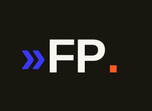

<p align="center">
  
</p>

<p align="center">
  📬 <a href="https://gblayer.github.io/forward-pass-newsletter/"><b>Subscribe</b></a>
  &nbsp;·&nbsp; <a href="https://gblayer.github.io/forward-pass-newsletter/rss.xml">RSS feed</a>
  &nbsp;·&nbsp; <a href="https://gblayer.github.io/forward-pass-newsletter/">Archive</a>
</p>

## About

**Forward Pass** is an automated **weekly** digest of the most relevant new
papers on **tabular foundation models** and the intersection of language models
and structured data — TabPFN / TabICL and tabular in-context learning, relational
& multi-table foundation models, neural processes, LLM embeddings for tables,
benchmarks, and the industry moves around them.

Every **Monday** it sweeps the previous week's arXiv + HuggingFace, scores every
candidate against a research topic profile, reads the top ~10 papers, and writes
a short **problem → method → results → limitations** digest for each — plus a
"this week in industry" section and a one-line **In brief** summary. The
pipeline is AI-assisted and runs autonomously — no servers to babysit —
delivered by email and published to the web, free at any scale.

### What's at [gblayer.github.io/forward-pass-newsletter](https://gblayer.github.io/forward-pass-newsletter/)?

The newsletter's free public home — no signup, unsubscribe anytime:

- 🗂️ **Archive** — every issue as its own web page, newest first.
- 📡 **Subscribe box** — copy the RSS feed URL into any reader (Inoreader,
  NetNewsWire, Thunderbird, …); unsubscribe by removing the feed.
- 🔗 **RSS feed** (`/rss.xml`) — new issues arrive in your reader automatically.

## How it works

```
┌─ Stage 1: CANDIDATE GENERATION (broad, cheap) ──────────────────────┐
│  • arXiv sweep of cs.LG/stat.ML/cs.AI/cs.CL/cs.DB/cs.IR (last 24h)  │
│    → generous keyword prefilter (config.yaml: prefilter_keywords)   │
│  • arXiv author queries for every watchlist author                  │
│  • HuggingFace Daily Papers (all of them)                           │
│  • OpenReview recent-notes search (best-effort)                     │
│  • [optional] Semantic Scholar: new papers citing your seed papers  │
└──────────────────────────────────────────────────────────────────────┘
┌─ Stage 2: RELEVANCE JUDGMENT (Claude Haiku, batched) ───────────────┐
│  Each candidate is scored 0-10 against your TOPIC PROFILE — a rich  │
│  natural-language description of your PhD. This is what makes the   │
│  filter broad: adapters, distillation, TFM efficiency, table        │
│  serialization etc. get caught even with zero keyword overlap.      │
└──────────────────────────────────────────────────────────────────────┘
┌─ Stage 3: DIGEST (Claude Sonnet) ───────────────────────────────────┐
│  Top papers get a pedagogical 3-bullet summary:                     │
│  problem/goal → method → limitations, plus the link.                │
└──────────────────────────────────────────────────────────────────────┘
```

Runs on GitHub Actions cron every morning. Dedup state
(`seen_papers.json`) is committed back to the repo, so overlapping
windows and updated arXiv versions never spam you twice.

## Setup (~10 minutes)

1. **Create a GitHub repo** and push this folder to it.

2. **Add repository secrets** (Settings → Secrets and variables →
   Actions → New repository secret):

   | Secret | Value |
   |---|---|
   | `ANTHROPIC_API_KEY` | from console.anthropic.com |
   | `SMTP_USER` | your Gmail address |
   | `SMTP_PASSWORD` | a Gmail **App Password** (myaccount.google.com → Security → 2-Step Verification → App passwords) — *not* your normal password |
   | `NEWSLETTER_TO` | the address that receives the digest (can equal `SMTP_USER`) |
   | `S2_API_KEY` | *(optional)* Semantic Scholar key, only if you enable `semantic_scholar` in config |

   Not on Gmail? Any SMTP provider works — change `smtp_host`/`smtp_port`
   in `config.yaml`.

3. **Send issue #1 (last week's papers):** Actions tab → *Daily Tabular
   ML Newsletter* → Run workflow → tick **first_run** → Run.

   Tip: tick **dry_run** too on your very first attempt — instead of
   emailing, it uploads `preview.html` as a workflow artifact so you can
   check the output and tune `config.yaml` before going live.

4. Done. The cron fires daily at 07:30 UTC (delivered before 10:00 Paris).
   arXiv announces new submissions around midnight UTC Mon–Fri, so the
   morning run catches the fresh batch. Weekends are naturally quiet.

## Tuning

Everything lives in `config.yaml`:

- **`topic_profile`** — the heart of the system. If you start a new
  research thread (e.g. test-time adaptation), add two lines here and
  the filter follows. No code changes.
- **`author_watchlist`** — new papers by these people are candidates
  regardless of keywords.
- **`max_papers_in_newsletter`** — daily cap (default 12).
- **Threshold too loose/strict?** Change `threshold` in
  `newsletter/relevance.py::filter_papers` (default 6/10), or just make
  the NOT-relevant section of the topic profile more explicit.

## Email subscribers (Resend Audiences + Cloudflare Worker)

The site's subscribe form stores signups in a **Resend Audience**; each email
carries a per-recipient **one-click unsubscribe** link (RFC 8058 headers, so
Gmail/Yahoo show their native inbox Unsubscribe button). GitHub Pages is
static, so a tiny **Cloudflare Worker** (`infra/subscribe-worker.js`) relays
the form to Resend without exposing the API key. Free up to 1,000 contacts.

One-time setup:

1. **Resend** ([resend.com](https://resend.com)): create an account → API key
   → Audiences → create one → copy its **Audience ID**.
2. **Cloudflare** ([dash.cloudflare.com](https://dash.cloudflare.com), free):
   Workers → Create → paste `infra/subscribe-worker.js`. Under the Worker's
   *Settings → Variables and Secrets* add: `RESEND_API_KEY`,
   `RESEND_AUDIENCE_ID`, `UNSUB_SECRET` (any long random string) as secrets,
   and `ALLOWED_ORIGIN` = `https://gblayer.github.io` as a variable. Deploy
   and copy the `*.workers.dev` URL.
3. **config.yaml**: set `site.subscribe_endpoint` to that Worker URL.
4. **Send-time env** (routine environment / CI secrets): add the same
   `RESEND_API_KEY`, `RESEND_AUDIENCE_ID`, and `UNSUB_SECRET` so the sender
   can read the audience and sign unsubscribe links.

Delivery still goes through your existing transport (Gmail API / SMTP);
Resend only stores the list. Subscribers merge with `NEWSLETTER_TO`, deduped.
Unsubscribes flip `unsubscribed: true` on the contact and are skipped on the
next send. Everything degrades gracefully: with no endpoint configured the
site shows the RSS-only box and emails use a mailto unsubscribe fallback.

## Local testing

```bash
pip install -r requirements.txt
export ANTHROPIC_API_KEY=sk-ant-...
python -m newsletter.main --first-run --dry-run   # writes preview.html
open preview.html
```

## Costs

- GitHub Actions: free (public repo) or well within free tier (private).
- Claude API: roughly $0.05–0.30/day depending on candidate volume —
  Haiku scores ~50–200 abstracts in batches, Sonnet writes ≤12 summaries.
- arXiv / HF / OpenReview APIs: free.

---

<p align="center">
  
  <br>
  <sub><b>⏩ Forward Pass</b> — AI-assisted. Built weekly, read anywhere.</sub>
</p>
